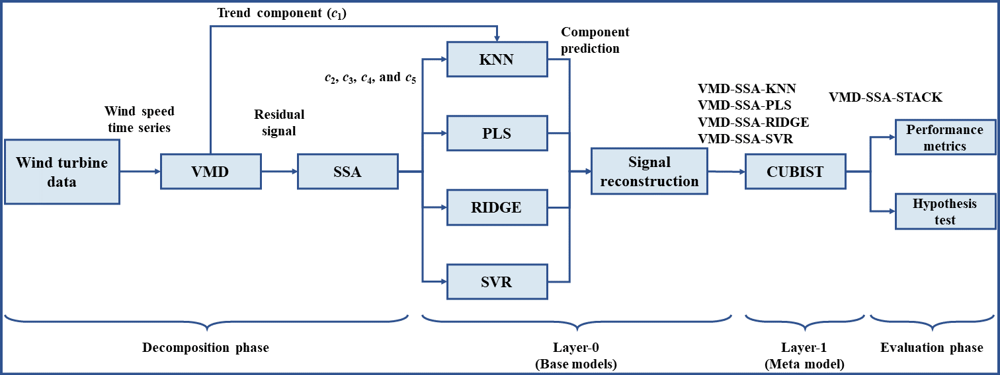

# Publication in

## :zap: Wind speed multi-step ahead forecasting based on dual signal decomposition coupled with stacking-ensemble learning approach

[</img> Ramon Gomes da Silva](https://orcid.org/0000-0001-8580-7695), [</img> Sinvaldo Rodrigues Moreno](https://orcid.org/0000-0001-6565-9605), [</img> Matheus H. D. M. Ribeiro](https://orcid.org/0000-0001-7387-9077), [</img> Viviana Cocco Mariani](https://orcid.org/0000-0003-2490-4568), [</img> Leandro dos Santos Coelho](https://orcid.org/0000-0001-5728-943X)

\| :---\| ***Proposed forecasting framework***\|

### Publication

-   [Preprint (ResearchGate)]()
-   [Journal paper (ScienceDirect)]()

### How to cite this paper

``` bibtex
```
